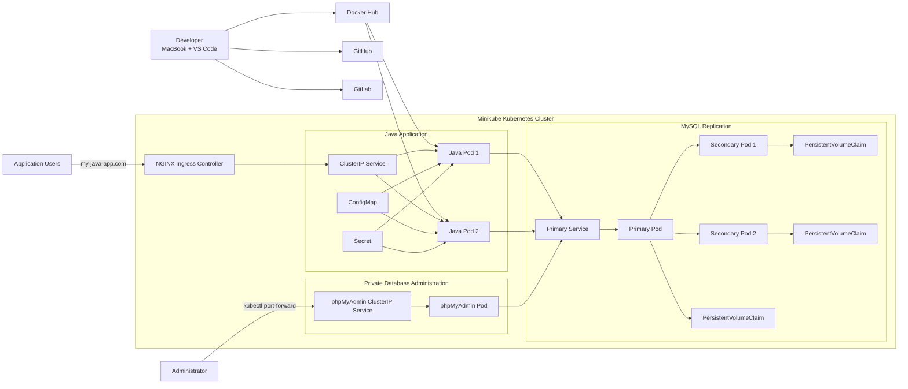

# Java–MySQL Kubernetes Platform

A production-aware Kubernetes migration of a Java and MySQL application from a single-server Docker Compose deployment to a resilient, declarative container orchestration platform.

This project demonstrates Kubernetes workload management, persistent database storage, application replication, Service discovery, configuration management, private administrative access, NGINX Ingress, Helm packaging, Helmfile orchestration, deployment validation, secure Git practices, and repeatable local operations.

---

## Table of Contents

* [Project Overview](#project-overview)
* [Architecture](#architecture)
* [Engineering Objectives](#engineering-objectives)
* [Technology Stack](#technology-stack)
* [Repository Structure](#repository-structure)
* [Related Helm Chart](#related-helm-chart)
* [Prerequisites](#prerequisites)
* [Local Cluster Setup](#local-cluster-setup)
* [Build and Publish the Java Image](#build-and-publish-the-java-image)
* [Deploy MySQL](#deploy-mysql)
* [Create Application Secrets](#create-application-secrets)
* [Deploy the Java Application](#deploy-the-java-application)
* [Test Kubernetes Self-Healing](#test-kubernetes-self-healing)
* [Deploy phpMyAdmin](#deploy-phpmyadmin)
* [Configure Application Ingress](#configure-application-ingress)
* [Deploy with Helmfile](#deploy-with-helmfile)
* [Validation](#validation)
* [Security Practices](#security-practices)
* [Availability Limitations](#availability-limitations)
* [Git Workflow](#git-workflow)
* [Deployment Evidence](#deployment-evidence)
* [Cleanup](#cleanup)
* [Key Engineering Decisions](#key-engineering-decisions)
* [Future Improvements](#future-improvements)
* [Author](#author)

---

## Project Overview

The original application depended on a single Docker host running the Java application and MySQL database through Docker Compose.

If the Java container, MySQL container, Docker daemon, or underlying server failed, the application became unavailable until an engineer manually connected to the server and restarted the affected services.

This project replaces that operational model with Kubernetes.

The new architecture provides:

* Two Java application replicas
* Replicated MySQL topology
* Persistent database volumes
* Automatic Pod recreation
* Stable Kubernetes Services
* ConfigMap-based non-sensitive configuration
* Secret-based credential injection
* NGINX Ingress routing
* Domain-based application access
* Private phpMyAdmin access through local port-forwarding
* A reusable Java application Helm chart
* Declarative Helmfile release management
* Liveness and readiness probes
* Resource requests and limits
* Non-root application containers
* Rolling deployment strategy
* Pod disruption protection
* Automated deployment validation

The platform is designed as a local production-style learning environment using Minikube while following patterns that can later be adapted to managed Kubernetes platforms.

---

## Architecture



### Application request flow

```text
Application User
        |
        v
my-java-app.com
        |
        v
NGINX Ingress Controller
        |
        v
Java Application ClusterIP Service
        |
        +-------------------+
        |                   |
        v                   v
 Java Application Pod 1  Java Application Pod 2
        |                   |
        +---------+---------+
                  |
                  v
         mysql-primary Service
                  |
                  v
           MySQL Primary Pod
                  |
        +---------+---------+
        |                   |
        v                   v
 MySQL Secondary Pod 1  MySQL Secondary Pod 2
```

---

## Engineering Objectives

1. Remove dependence on manually restarting Docker Compose services.
2. Maintain multiple Java application replicas.
3. Use replicated and persistent database infrastructure.
4. Separate application configuration from the container image.
5. Keep database administration interfaces private.
6. Provide hostname-based application access.
7. Package Kubernetes resources into a reusable Helm chart.
8. Manage application releases declaratively with Helmfile.
9. Maintain professional Git history across GitHub and GitLab.
10. Build a portfolio project that demonstrates production engineering practices.
11. Validate deployments through repeatable scripts and Makefile commands.
12. Protect credentials and other sensitive configuration from Git history.

---

## Technology Stack

| Category                      | Technology                    |
| ----------------------------- | ----------------------------- |
| Application                   | Java, Spring Boot, Gradle     |
| Containerization              | Docker                        |
| Container registry            | Docker Hub                    |
| Container orchestration       | Kubernetes                    |
| Local Kubernetes cluster      | Minikube                      |
| Database                      | MySQL                         |
| Database administration       | phpMyAdmin                    |
| Kubernetes package management | Helm                          |
| Multi-release orchestration   | Helmfile                      |
| Ingress                       | NGINX Ingress Controller      |
| Source control                | Git                           |
| Remote repositories           | GitHub and GitLab             |
| Validation                    | kubectl, Helm, Helmfile, Bash |
| Security scanning             | Trivy                         |
| Local operating environment   | macOS and Docker Desktop      |

---

## Repository Structure

```text
.
├── Dockerfile
├── Makefile
├── README.md
├── build.gradle
├── settings.gradle
├── docs/
│   ├── architecture/
│   └── screenshots/
├── helmfile/
│   ├── helmfile.yaml
│   └── environments/
│       └── local/
├── kubernetes/
│   ├── base/
│   ├── ingress/
│   ├── mysql/
│   └── phpmyadmin/
├── scripts/
└── src/
```

### Directory responsibilities

| Path                     | Purpose                                                        |
| ------------------------ | -------------------------------------------------------------- |
| `Dockerfile`             | Builds the Java application container image                    |
| `Makefile`               | Provides repeatable local development and deployment commands  |
| `docs/architecture/`     | Stores architecture documentation and diagrams                 |
| `docs/screenshots/`      | Stores non-sensitive deployment evidence                       |
| `helmfile/`              | Defines declarative Helm release orchestration                 |
| `kubernetes/base/`       | Contains Java application Kubernetes manifests                 |
| `kubernetes/ingress/`    | Contains NGINX Ingress configuration                           |
| `kubernetes/mysql/`      | Contains MySQL Helm values and supporting configuration        |
| `kubernetes/phpmyadmin/` | Contains the private phpMyAdmin deployment                     |
| `scripts/`               | Contains build, deployment, validation, and cleanup automation |
| `src/`                   | Contains the Java Spring Boot source code                      |

---

## Related Helm Chart

The Java application Helm chart is maintained in a separate repository:

* GitHub: `younghadiz/java-app-helm-chart`
* GitLab: `younghadiz/java-app-helm-chart`

Maintaining the chart separately provides:

* Independent chart versioning
* Reuse across multiple environments
* Separation between application source and deployment packaging
* Independent chart testing and release management
* Easier publishing to a Helm or OCI registry

---

## Prerequisites

Install the following tools before running the project:

* macOS
* Docker Desktop
* Git
* kubectl
* Minikube
* Helm
* Helmfile
* Docker Hub account
* GitHub account
* GitLab account

Verify the required tools:

```bash
docker version
kubectl version --client
minikube version
helm version
helmfile --version
git --version
```

Docker Desktop must be running before starting Minikube with the Docker driver.

---

## Local Cluster Setup

Start the dedicated Minikube cluster:

```bash
make cluster
```

The command performs the following operations:

* Starts the `java-mysql-platform` Minikube profile
* Uses Docker as the Minikube driver
* Allocates the required CPU, memory, and storage
* Enables the NGINX Ingress addon
* Creates the `java-mysql` namespace
* Waits for Kubernetes node readiness
* Verifies the local cluster context

Validate the cluster:

```bash
kubectl config current-context
kubectl get nodes -o wide
kubectl get namespaces
kubectl get pods -n ingress-nginx
```

Verify the Minikube profile:

```bash
minikube status --profile java-mysql-platform
```

Expected Kubernetes context:

```text
java-mysql-platform
```

Expected application namespace:

```text
java-mysql
```

---

## Build and Publish the Java Image

Set the Docker Hub username and immutable image tag:

```bash
export DOCKERHUB_USERNAME="your-dockerhub-username"
export IMAGE_TAG="1.0.0"
```

Authenticate with Docker Hub:

```bash
docker login --username "${DOCKERHUB_USERNAME}"
```

Build and publish the image:

```bash
./scripts/build-and-push-image.sh
```

The Dockerfile uses:

* Multi-stage image construction
* Gradle compilation and testing
* Java 17 runtime
* Non-root execution
* Reduced runtime image size
* Container-aware JVM memory settings
* Immutable image tags

Verify the local image:

```bash
docker image ls
```

Inspect the image:

```bash
docker image inspect \
  "${DOCKERHUB_USERNAME}/java-mysql-app:${IMAGE_TAG}"
```

Optional vulnerability scan:

```bash
trivy image \
  "${DOCKERHUB_USERNAME}/java-mysql-app:${IMAGE_TAG}"
```

---

## Standalone Docker Validation

Before deploying the image to Kubernetes, the container can be tested against the Kubernetes-hosted MySQL database.

The Java application expects the following environment variables:

```text
DB_SERVER
DB_NAME
DB_USER
DB_PWD
```

The current application configuration uses the standard MySQL port:

```text
3306
```

Forward the Kubernetes MySQL Service to the local machine:

```bash
kubectl port-forward \
  --address 0.0.0.0 \
  --namespace java-mysql \
  service/mysql-primary \
  3306:3306
```

Keep the port-forward running.

In another terminal, run the application container:

```bash
docker run --rm \
  --name java-mysql-app-test \
  -p 8082:8080 \
  -e DB_SERVER=host.docker.internal \
  -e DB_NAME=java_app_db \
  -e DB_USER=java_app_user \
  -e DB_PWD='<DATABASE_PASSWORD>' \
  java-mysql-app:release-candidate
```

Successful application logs should contain:

```text
Java app started
Tomcat started on port 8080
Started Application
```

While the container remains running, test it from another terminal:

```bash
curl -i http://127.0.0.1:8082/
```

Do not stop the container before running the `curl` command.

---

## Deploy MySQL

Create a private local values file:

```bash
cp \
  kubernetes/mysql/values.yaml \
  kubernetes/mysql/values.local.yaml
```

Replace all placeholder passwords in:

```text
kubernetes/mysql/values.local.yaml
```

The local values file must remain excluded from Git.

Add the Bitnami Helm repository:

```bash
helm repo add bitnami https://charts.bitnami.com/bitnami
helm repo update
```

Install or upgrade MySQL:

```bash
helm upgrade --install mysql bitnami/mysql \
  --namespace java-mysql \
  --create-namespace \
  --values kubernetes/mysql/values.local.yaml \
  --wait \
  --timeout 15m
```

Validate the release:

```bash
helm status mysql -n java-mysql
kubectl get statefulsets -n java-mysql
kubectl get pods -n java-mysql -o wide
kubectl get pvc -n java-mysql
kubectl get services -n java-mysql
```

The training-compatible MySQL configuration uses:

```yaml
architecture: replication

secondary:
  replicaCount: 2
```

This creates:

* One MySQL primary Pod
* Two MySQL secondary Pods
* Three PersistentVolumeClaims
* Stable primary and secondary Services

Verify the primary Service:

```bash
kubectl get service mysql-primary \
  --namespace java-mysql
```

Verify the Service endpoints:

```bash
kubectl get endpoints mysql-primary \
  --namespace java-mysql
```

---

## Create Application Secrets

Export the database credentials:

```bash
export DB_USER="java_app_user"
export DB_PASSWORD="your-local-database-password"
```

Export the Docker Hub registry credentials:

```bash
export DOCKERHUB_USERNAME="your-dockerhub-username"
export DOCKERHUB_TOKEN="your-dockerhub-access-token"
export DOCKERHUB_EMAIL="your-email"
```

Create the required Kubernetes Secrets:

```bash
make secrets
```

The generated Secrets provide:

* Java application database credentials
* Docker Hub image-pull authentication

Real credentials are never stored directly in this repository.

Verify Secret names without displaying their values:

```bash
kubectl get secrets \
  --namespace java-mysql
```

Do not decode or capture Secret values in screenshots.

---

## Deploy the Java Application

Update the application image repository and tag in:

```text
kubernetes/base/deployment.yaml
```

Deploy the Java application:

```bash
make app
```

Validate the rollout:

```bash
kubectl rollout status deployment/java-app \
  --namespace java-mysql
```

Inspect the application resources:

```bash
kubectl get deployment,replicaset,pod,service \
  --namespace java-mysql
```

Verify the Java Service endpoints:

```bash
kubectl get endpoints java-app \
  --namespace java-mysql
```

Inspect application logs:

```bash
kubectl logs \
  --namespace java-mysql \
  deployment/java-app \
  --tail=100
```

Follow logs continuously:

```bash
kubectl logs \
  --namespace java-mysql \
  deployment/java-app \
  --follow
```

A successful startup should contain:

```text
Java app started
Tomcat started on port 8080
Started Application
```

---

## Test Kubernetes Self-Healing

List the Java application Pods:

```bash
kubectl get pods \
  --namespace java-mysql \
  --selector app.kubernetes.io/name=java-app
```

Delete one application Pod:

```bash
kubectl delete pod \
  --namespace java-mysql \
  "$(kubectl get pods \
    --namespace java-mysql \
    --selector app.kubernetes.io/name=java-app \
    --output jsonpath='{.items[0].metadata.name}')"
```

Watch Kubernetes create a replacement:

```bash
kubectl get pods \
  --namespace java-mysql \
  --selector app.kubernetes.io/name=java-app \
  --watch
```

The Deployment controller detects that the number of running Pods is lower than the declared replica count and automatically creates a replacement.

This demonstrates Kubernetes self-healing at the Pod level.

---

## Deploy phpMyAdmin

Deploy phpMyAdmin:

```bash
make phpmyadmin
```

phpMyAdmin uses a Kubernetes `ClusterIP` Service.

It is not exposed through:

* Ingress
* NodePort
* LoadBalancer
* Public IP address

Verify the resources:

```bash
kubectl get deployment,service \
  --namespace java-mysql \
  --selector app.kubernetes.io/name=phpmyadmin
```

Access phpMyAdmin through local port-forwarding:

```bash
make port-forward
```

Open:

```text
http://127.0.0.1:8081
```

Stop the port-forward with:

```text
Ctrl+C
```

This access model keeps the administrative interface private while still allowing authorized local access.

---

## Configure Application Ingress

Apply the Ingress configuration:

```bash
make ingress
```

Verify the NGINX Ingress Controller:

```bash
kubectl get pods \
  --namespace ingress-nginx
```

Get the Minikube IP:

```bash
minikube ip \
  --profile java-mysql-platform
```

Add the IP and hostname to `/etc/hosts`:

```text
MINIKUBE_IP my-java-app.com
```

Example:

```text
192.168.49.2 my-java-app.com
```

Depending on the macOS and Docker Desktop networking configuration, start a Minikube tunnel:

```bash
minikube tunnel \
  --profile java-mysql-platform
```

Open the application:

```text
http://my-java-app.com
```

Test with `curl`:

```bash
curl -I http://my-java-app.com
```

Inspect the Ingress resource:

```bash
kubectl get ingress \
  --namespace java-mysql
```

```bash
kubectl describe ingress java-app \
  --namespace java-mysql
```

---

## Deploy with Helmfile

Create the ignored local values files:

```bash
cp \
  helmfile/environments/local/mysql-values.yaml \
  helmfile/environments/local/mysql-values.local.yaml
```

```bash
cp \
  helmfile/environments/local/java-app-values.example.yaml \
  helmfile/environments/local/java-app-values.local.yaml
```

Update the local values with:

* Java application image repository
* Java application image tag
* MySQL credentials
* MySQL configuration
* Local environment settings

Change into the Helmfile directory:

```bash
cd helmfile
```

Display the release dependency graph:

```bash
helmfile show-dag
```

Render the releases:

```bash
helmfile template
```

Review proposed changes:

```bash
helmfile diff
```

Apply the releases:

```bash
helmfile apply
```

The Java application release depends on the MySQL release.

This ensures Helmfile installs or upgrades MySQL before deploying the Java application.

Verify the releases:

```bash
helm list \
  --namespace java-mysql
```

---

## Validation

Run the automated validation workflow:

```bash
make validate
```

The validation process checks:

* Current Kubernetes context
* Kubernetes node readiness
* Namespace availability
* Helm release status
* MySQL StatefulSets
* Bound PersistentVolumeClaims
* MySQL Services and endpoints
* Java Deployment rollout
* Expected Java application replica count
* Java Service endpoints
* Ingress availability
* HTTP application response
* Overall deployment readiness

Manual validation commands include:

```bash
kubectl config current-context
kubectl get nodes
kubectl get namespaces
helm list -n java-mysql
kubectl get statefulsets -n java-mysql
kubectl get pvc -n java-mysql
kubectl get deployments -n java-mysql
kubectl get pods -n java-mysql
kubectl get services -n java-mysql
kubectl get endpoints -n java-mysql
kubectl get ingress -n java-mysql
```

Validate the Java rollout:

```bash
kubectl rollout status deployment/java-app \
  --namespace java-mysql \
  --timeout=180s
```

Test the Java Service through port-forwarding:

```bash
kubectl port-forward \
  --namespace java-mysql \
  service/java-app \
  8082:8080
```

From another terminal:

```bash
curl -i http://127.0.0.1:8082/
```

---

## Security Practices

The project demonstrates the following security controls:

* Non-root Java container
* Privilege escalation disabled
* Dropped Linux capabilities
* Runtime-default seccomp profile
* Read-only application root filesystem
* Private phpMyAdmin Service
* Localhost-only administrative port-forwarding
* Separate ConfigMap and Secret resources
* Git-ignored local Secret values
* Docker Hub access-token authentication
* Resource requests and limits
* Immutable application image tags
* ServiceAccount token automount disabled in the Helm chart
* Private database Services
* No public MySQL endpoint
* No public phpMyAdmin endpoint
* Image vulnerability scanning with Trivy
* No credentials embedded in the application image

### Information That Must Never Be Committed

Never commit:

* Database passwords
* Docker Hub access tokens
* GitHub personal access tokens
* GitLab personal access tokens
* kubeconfig files
* Kubernetes bearer tokens
* SSH private keys
* Cloud API credentials
* Rendered Kubernetes Secret manifests
* Real production values files
* Unencrypted `.env` files
* TLS private keys
* Registry authentication files

Before committing changes, inspect them:

```bash
git status
git diff
git diff --cached
```

Search tracked files for accidental credentials:

```bash
git grep -n "password"
git grep -n "token"
git grep -n "secret"
```

Review all matches before pushing.

Any credential exposed in:

* Terminal output
* Chat messages
* Screenshots
* CI logs
* Git history

must be treated as compromised and rotated.

---

## Availability Limitations

Minikube is a local, single-node Kubernetes learning environment.

Running two Java application replicas demonstrates:

* Deployment replica management
* Service load balancing
* Rolling updates
* Pod replacement
* Pod disruption controls

However, it does not provide full infrastructure-level high availability because all workloads run on one Kubernetes node.

If the Minikube node, Docker Desktop, or the local MacBook becomes unavailable, the entire platform becomes unavailable.

A production environment would use:

* Multi-node managed Kubernetes
* Multiple availability zones
* Managed MySQL
* Automated database backups
* Point-in-time recovery
* TLS certificates
* cert-manager
* External Secrets
* Kubernetes NetworkPolicies
* Pod anti-affinity
* Topology spread constraints
* Monitoring and alerting
* Centralized logging
* GitOps deployment
* CI/CD security scanning
* Disaster-recovery procedures

---

## Git Workflow

The repository uses the following branch model:

```text
main
  ↑
develop
  ↑
feature/*
```

### Feature development

Create a feature branch from `develop`:

```bash
git checkout develop
git pull --ff-only github develop
git checkout -b feature/branch-name
```

Commit the completed work:

```bash
git add .
git commit -m "feat: describe the completed feature"
```

Merge the feature branch into `develop`:

```bash
git checkout develop
git pull --ff-only github develop
git merge --no-ff feature/branch-name
```

Push `develop`:

```bash
git push github develop
git push gitlab develop
```

### Production release

Update `main`:

```bash
git checkout main
git pull --ff-only github main
```

Merge `develop` into `main`:

```bash
git merge --no-ff develop \
  -m "release: merge Java MySQL Kubernetes platform into main"
```

Push to both remote repositories:

```bash
git push github main
git push gitlab main
```

Using `--no-ff` preserves feature and release boundaries in the Git history.

---

## Deployment Evidence

Recommended deployment evidence is stored under:

```text
docs/screenshots/
```

Suggested evidence includes:

* Repository structure
* Feature branch history
* Merge history
* Docker image build
* Docker Hub image repository
* Trivy image scan
* Minikube cluster
* Kubernetes node readiness
* MySQL StatefulSets
* MySQL primary and secondary Pods
* PersistentVolumeClaims
* Java application replicas
* Java Service endpoints
* Kubernetes self-healing test
* phpMyAdmin local port-forward
* NGINX Ingress
* Domain-based application access
* Helm release status
* Helm chart validation
* Helmfile dependency graph
* Helmfile deployment
* End-to-end validation results

Sensitive information must be removed or hidden from all screenshots.

Do not capture:

* Passwords
* Tokens
* Secret values
* kubeconfig contents
* Registry credentials
* Private keys
* Authorization headers

---

## Cleanup

Run the cleanup workflow:

```bash
make clean
```

The cleanup script requires explicit confirmation before deleting the Helm releases and Minikube environment.

Manual cleanup may include:

```bash
helm uninstall java-app \
  --namespace java-mysql
```

```bash
helm uninstall mysql \
  --namespace java-mysql
```

```bash
kubectl delete namespace java-mysql
```

```bash
minikube delete \
  --profile java-mysql-platform
```

Verify cleanup:

```bash
minikube profile list
kubectl config get-contexts
```

Use cleanup commands carefully because PersistentVolumeClaims and local database data may be deleted.

---

## Key Engineering Decisions

### Kubernetes instead of manual Docker Compose recovery

Kubernetes continuously compares the desired state with the actual cluster state.

If a Java Pod fails or is deleted, the Deployment controller automatically creates a replacement.

This removes the requirement for an engineer to manually restart the application container.

### Deployment for the Java application

The Java application is treated as stateless.

Multiple interchangeable Pods can run behind one stable Kubernetes Service.

A Deployment provides:

* Replica management
* Rolling updates
* Rollback support
* Self-healing
* Declarative desired state

### Stateful database deployment

MySQL requires:

* Persistent storage
* Stable network identity
* Ordered Pod management
* Replication configuration
* Primary-secondary relationships

The Bitnami MySQL Helm chart manages these stateful requirements.

### Replicated MySQL topology

The local training environment uses one primary and two secondary Pods.

This demonstrates database replication and stateful Kubernetes workloads.

It does not replace managed database high availability in a production environment.

### ConfigMap and Secret separation

Non-sensitive configuration is stored separately from credentials.

The Java application receives:

```text
DB_SERVER
DB_NAME
```

through non-sensitive configuration and receives:

```text
DB_USER
DB_PWD
```

through Kubernetes Secrets.

### ClusterIP for internal services

MySQL and phpMyAdmin are exposed only through internal `ClusterIP` Services.

This prevents direct public access to database and administrative endpoints.

### Ingress for application traffic

Application users access the platform through a hostname.

Ingress provides a stable routing layer instead of exposing Pods or relying on manually managed host ports.

### Private phpMyAdmin access

phpMyAdmin is intentionally excluded from Ingress.

Administrators access it temporarily through:

```bash
kubectl port-forward
```

This reduces the attack surface of the platform.

### Separate Helm chart repository

The Java chart is maintained independently from the application repository.

This enables:

* Independent versioning
* Reuse
* Separate release cycles
* Environment-specific deployment values
* Future OCI registry publishing

### Helmfile orchestration

Helmfile defines the complete application stack as declarative Helm releases.

It also expresses the dependency relationship between MySQL and the Java application.

### Immutable container images

Application deployments use explicit image tags rather than `latest`.

Immutable tags improve:

* Reproducibility
* Rollback reliability
* Deployment traceability
* Auditability

### Automated validation

Validation scripts reduce reliance on manual visual inspection.

The platform verifies Kubernetes resources, Helm releases, Services, endpoints, rollouts, and HTTP responses through repeatable commands.

---

## Future Improvements

Planned improvements include:

* GitHub Actions or Jenkins CI/CD
* Automated Helm chart publishing to an OCI registry
* Argo CD or Flux GitOps
* External Secrets Operator
* cert-manager TLS
* Kubernetes NetworkPolicies
* Prometheus and Grafana
* Loki or OpenSearch centralized logging
* MySQL backup automation
* Point-in-time database recovery
* Horizontal Pod Autoscaling
* Vertical Pod Autoscaling
* Pod anti-affinity
* Topology spread constraints
* Policy-as-code
* Software bill of materials generation
* Container image signing and verification
* Multi-environment Helmfile structure
* Managed Kubernetes deployment
* Managed database migration
* Automated integration testing
* Progressive delivery
* Deployment approval controls
* Disaster-recovery testing

---

## ## Profiles and Repositories. 

Connect With Me

GitHub: github.com/younghadiz
GitLab: gitlab.com/devops-engineering-projects

## Tags

DevOps Engineer focused on AWS, Kubernetes, Docker, CI/CD, Terraform, Ansible, Linux, automation, observability, and secure cloud infrastructure.